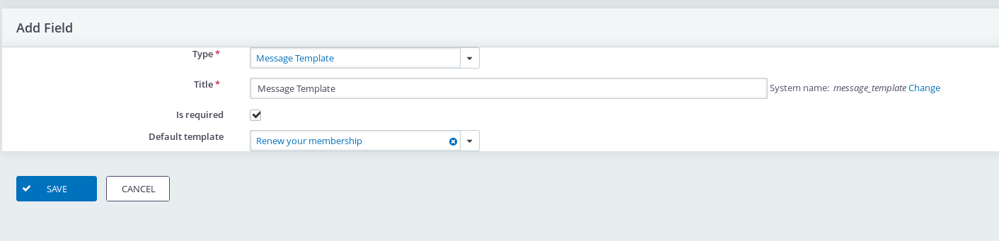
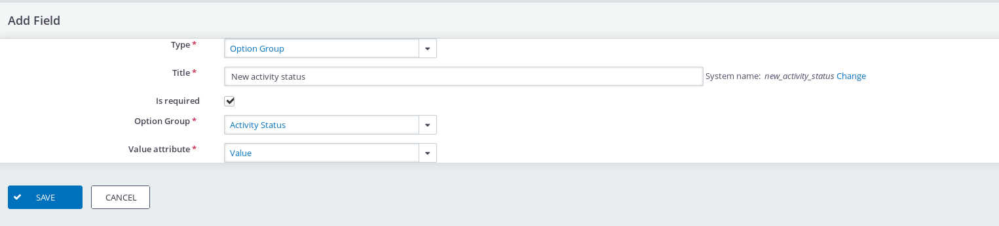

# Form Field Library

This extension has a collection of form fields which can be used in other extensions.
For example the Search Action Designer uses this Form Field Library to provide field types on the form after a search.

Below an example of the *Message Template* field and the *Option Group* field. The latter is configured to show the activity status.


Below the configuration screen of the *Message Template* field. 



And below the configuration of the *Option Group* field.



The screenshots are from the *Search Action Designer* extension and the forms are implemented in that extension, however this extension provides
helper functions to implement easily fields. 

The extension is licensed under [AGPL-3.0](LICENSE.txt).

## Documentation

* [List of available fields](docs/available_fields.md)

## Developer documentation

* [How to use this in an extension](docs/howto_use_in_your_extension.md)
* [How to create your own field type](docs/add_your_own_field_type.md)

## Requirements

* PHP v5.6+
* CiviCRM v5.0+

## Installation (Web UI)

This extension has not yet been published for installation via the web UI.

## Installation (CLI, Zip)

Sysadmins and developers may download the `.zip` file for this extension and
install it with the command-line tool [cv](https://github.com/civicrm/cv).

```bash
cd <extension-dir>
cv dl formfieldlibrary@https://lab.civicrm.org/extensions/formfieldlibrary/repository/master/archive.zip
```

## Installation (CLI, Git)

Sysadmins and developers may clone the [Git](https://en.wikipedia.org/wiki/Git) repo for this extension and
install it with the command-line tool [cv](https://github.com/civicrm/cv).

```bash
git clone https://lab.civicrm.org/extensions/formfieldlibrary.git
cv en formfieldlibrary
```

## Usage

This extension does not have any configuration are user interface. It is a library to be used in other extensions.


